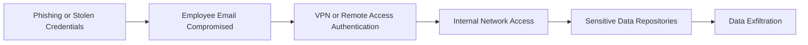
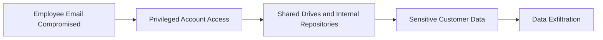
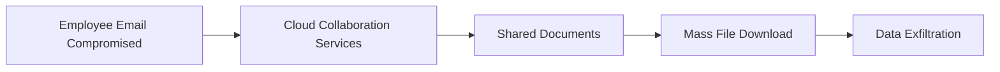
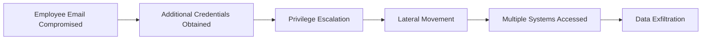

# Attack Path Analysis

## Overview

The compromise of an employee email account is the only publicly confirmed initial access point. However, it does not independently explain the reported exposure of approximately 3 TB of organizational data.

The following scenarios evaluate plausible attacker progression after the initial compromise. These scenarios are investigative hypotheses intended to guide incident response and evidence collection rather than represent confirmed attacker behavior.

---

# Scenario 1 — Employee Email Compromise to Internal Network Access

## Attack Path

### Assessment

If the compromised email credentials were reused for VPN or other enterprise services, the attacker could have gained access to internal resources beyond the mailbox itself. From there, data discovery and collection activities may have preceded exfiltration.

**Evidence Required**

- Email gateway logs
- Identity provider logs
- VPN authentication logs
- Firewall logs
- Endpoint telemetry

---

# Scenario 2 — Compromise of a Privileged Employee

## Attack Path

### Assessment

If the affected employee possessed elevated privileges or access to shared repositories, the attacker may have been able to retrieve significant amounts of sensitive information without directly compromising critical banking infrastructure.

**Evidence Required**

- Active Directory logs
- Privileged Access Management logs
- File server audit logs
- Database access logs
- User access reviews

---

# Scenario 3 — Cloud Collaboration Platform Access

## Attack Path

### Assessment

Modern organizations rely heavily on cloud collaboration platforms. Access to these services through a compromised employee account could allow attackers to download shared business documents and organizational data.

**Evidence Required**

- Cloud audit logs
- SharePoint or OneDrive activity
- File download history
- CASB logs
- Identity provider logs

---

# Scenario 4 — Credential Harvesting and Lateral Movement

## Attack Path

### Assessment

The reported volume of exposed data suggests that additional attacker activity beyond the compromised mailbox may have occurred. Credential harvesting followed by privilege escalation and lateral movement represents a plausible explanation for broader enterprise access.

**Evidence Required**

- Active Directory logs
- EDR telemetry
- Windows Security logs
- RDP and SMB activity
- Network traffic logs

---

## Overall Assessment

None of these attack paths can be confirmed using publicly available information. A complete forensic investigation would require correlating identity, endpoint, cloud, network, and data access evidence to reconstruct the actual attacker lifecycle.
